# Pathwise

**Ein szenariobasiertes Lernformat, das ehrenamtliche Trainerinnen und Trainer im Sportverein
darin unterstützt, mehrdeutige Situationen im Trainingsalltag einzuordnen.**

Ein Durchlauf dauert höchstens fünf Minuten: Situation lesen, an drei Entscheidungspunkten je
eine von drei Handlungsoptionen wählen, auf Abruf eine dreiteilige fachliche Rückmeldung lesen,
am Ende die Ampel-Einordnung der Situationsmerkmale, den Einschätzungsspiegel des Trainerteams
und die Ansprechpersonen des Vereins sehen. Ohne Anmeldung, jederzeit unterbrechbar.

Eine Flutter-Codebasis für **Web, iOS und Android**.

| Übersicht | Entscheidungspunkt | Fachliche Einordnung | Auswertung |
|---|---|---|---|
| 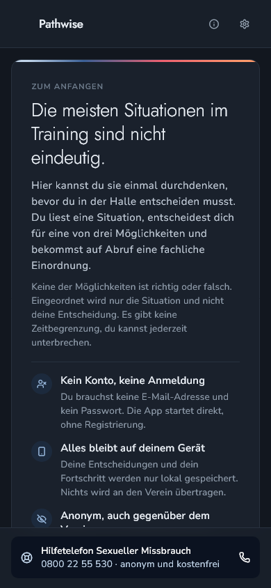 | 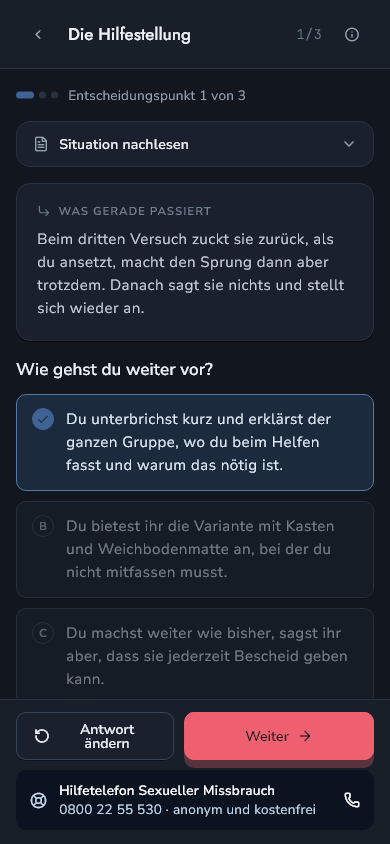 | 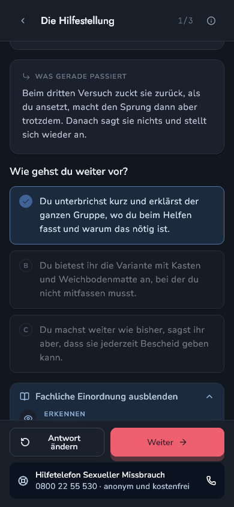 | 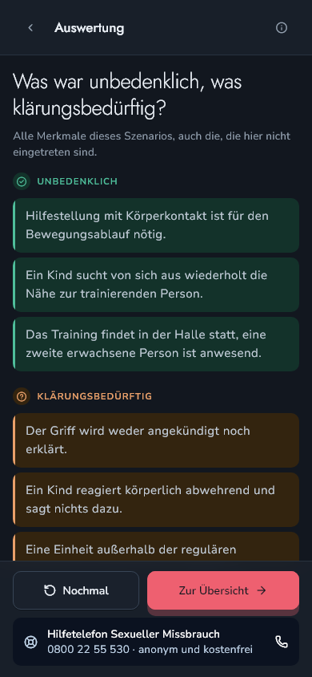 |

---

## Inhalt

- [Worum es geht](#worum-es-geht)
- [Warum es das braucht](#warum-es-das-braucht)
- [Was die Forschung dazu sagt — und was nicht](#was-die-forschung-dazu-sagt--und-was-nicht)
- [Abgrenzung zu bestehenden Angeboten](#abgrenzung-zu-bestehenden-angeboten)
- [Die sechs Grundfunktionen](#die-sechs-grundfunktionen)
- [Die fünf Regeln, die nicht gebrochen werden](#die-fünf-regeln-die-nicht-gebrochen-werden)
- [Der Durchlauf im Bild](#der-durchlauf-im-bild)
- [Datenschutz: was gespeichert wird](#datenschutz-was-gespeichert-wird)
- [Technik](#technik)
- [Einrichten und starten](#einrichten-und-starten)
- [Backend](#backend)
- [Qualitätssicherung](#qualitätssicherung)
- [Anforderungen und ihr Umsetzungsstand](#anforderungen-und-ihr-umsetzungsstand)
- [Grenzen](#grenzen)
- [Herkunft, Lizenzen, Quellen](#herkunft-lizenzen-quellen)

---

## Worum es geht

Pathwise stellt keine Wissensfragen. Es stellt Situationen.

Ein Vater bleibt in der Kabine, während sich die Kinder umziehen. Eine Turnerin weicht bei der
Hilfestellung zurück und sagt nichts dazu. Ein zuverlässiger Co-Trainer kümmert sich auffällig
um einen einzelnen Spieler. Drei Handlungsoptionen, keine davon offensichtlich falsch. Nach der
Wahl läuft die Situation weiter — unabhängig davon, wie entschieden wurde.

Am Ende wird nicht die Entscheidung bewertet, sondern die **Situation eingeordnet**: welche
Merkmale unbedenklich waren, welche klärungsbedürftig, welche eine Grenze verletzt hätten.
Aufgeführt werden auch Merkmale, die in diesem Durchlauf gar nicht eingetreten sind — sie
markieren die Schwelle, ab der eine Situation kippt.

Das Ziel ist **Unterscheidungsfähigkeit**, nicht pauschales Misstrauen. Deshalb ist die Stufe
„unbedenklich" genauso wichtig wie die beiden anderen: Sie erlaubt es, ein auffälliges Detail
ausdrücklich als harmlos auszuweisen.

Pathwise gehört zur **Prävention**. Es ersetzt keine Meldung, keine Beratung und keine
Intervention.

## Warum es das braucht

**Das Ausmaß.** Im Projekt „Safe Clubs" berichten rund 70 % der befragten Athletinnen und
Athleten von mindestens einer Erfahrung mit interpersonaler Gewalt im organisierten Sport;
sexualisierte Gewalt im engeren Sinn kommt darin mit 26 % ohne und 19 % mit Körperkontakt vor
(Schmitz et al., 2025). Die erste große deutsche Erhebung, Ohlert et al. (2018), kommt auf eine
Lebenszeitprävalenz von 37,6 %, davon 11,2 % schwere Formen.

**Wer handelt.** Bei Ohlert et al. waren **91 % der Täterinnen und Täter erwachsene
Betreuungspersonen** — Trainer, Physiotherapeuten, Funktionäre —, keine Gleichaltrigen.
Auffällig ist außerdem, was *keinen* Unterschied macht: weder Leistungsniveau noch Sportart,
Migrationshintergrund oder Behinderung. Das Risiko hängt weniger an der Sportart als an der
Kultur im Verein. Prävention muss also bei den Erwachsenen ansetzen, die den Trainingsalltag
gestalten.

**Warum Mehrdeutigkeit das eigentliche Problem ist.** Sexualisierte Gewalt beginnt in der Regel
mit scheinbar unbeabsichtigten Grenzverletzungen und schreitet schleichend voran. Dieselbe
Handlung — eine Berührung am Arm, eine Umarmung — kann je nach Kontext harmlos oder der Beginn
eines Grooming-Prozesses sein (Brackenridge & Fasting, 2005). Genau weil sich beginnendes
Grooming und unbedenkliches Verhalten äußerlich gleichen, können täterische Personen die
Reaktion ihres Gegenübers gefahrlos testen und sich bei Widerstand folgenlos zurückziehen.

Wer Trainerinnen und Trainer befähigen will, muss ihnen deshalb die **Einordnung mehrdeutiger
Fälle** beibringen — nicht das Erkennen eindeutiger Kategorien.

**Die Lücke im Verein.** Nur rund ein Zehntel der von Rulofs (2024) befragten Vereine verfügte
über Ansprechpersonen oder Schulungen; 31 % hatten überhaupt einen Ehrenkodex. Zwei
leitfadengestützte Experteninterviews im Post SV Nürnberg (Kinderschutzbeauftragter und ein
Trainer, Juli 2026) zeigen dasselbe Muster im Kleinen: Ein schriftliches Schutzkonzept liegt vor
— es hängt aber an einer einzelnen ehrenamtlichen Person, und bei den Trainerinnen und Trainern
kommt es im Alltag kaum an. Der befragte Trainer wendet sich bei Unsicherheit an Kollegen
derselben Altersklasse, nicht an ein Dokument.

Der Bedarf ist dabei **kein Wissensproblem, sondern ein Selbstbewusstseinsproblem**. Der
Kinderschutzbeauftragte beschreibt die verbreitete Abwehrhaltung als „Ich kann ja gar nichts
mehr machen, was darf ich denn überhaupt noch sagen" — und formuliert das Ziel als: den
Trainerinnen und Trainern „das Selbstbewusstsein geben, dass sie sich in einem bestimmten Rahmen
bewegen können, ohne etwas falsch zu machen". Dieselbe Sorge, wegen zugewandten Verhaltens
fälschlich beschuldigt zu werden, berichten Brackenridge und Fasting aus ihren
Kinderschutz-Workshops.

**Warum keine Schulung.** Ehrenamtliche lassen sich nicht über Zwang oder Bezahlung gewinnen,
sondern über Anreize aus der Tätigkeit selbst (Horch et al., 2024). Der Kinderschutzbeauftragte
rechnet damit, dass „jeder zweite Trainer, wenn nicht sogar mehr" auf zusätzliche
Verpflichtungen abweisend reagieren würde. Ein Instrument für diese Zielgruppe muss deshalb
freiwillig, im eigenen Tempo nutzbar und kurz sein — daher die Fünf-Minuten-Grenze und der
Verzicht auf Nachweise, Fristen und Pflichtabschlüsse.

## Was die Forschung dazu sagt — und was nicht

Die Gestaltungsentscheidungen stützen sich auf Befunde zu Serious Games und Gamification. Diese
Befunde sind hier **einschließlich ihrer Einschränkungen** wiedergegeben, weil mehrere davon die
Zielgruppe dieses Projekts direkt betreffen.

| Befund | Konsequenz für Pathwise |
|---|---|
| Serious Games erzielen gegenüber konventionellem Unterricht einen signifikant besseren Lernerfolg, beim Behalten über die Zeit sogar etwas mehr; bei der Motivation zeigt sich **kein** Unterschied (Wouters et al., 2013, 39 Studien, > 5.500 Teilnehmende) | Der Ansatz wird über den Lernerfolg begründet, nicht über einen Motivationsversprecher |
| Spielen in Gruppen wirkte etwa **dreifach** vorteilhafter als allein; ergänzende Methoden verstärken den Effekt, weil sie zum Versprachlichen zwingen | Der Einschätzungsspiegel schafft den Anlass für das Gespräch im Trainerteam |
| **Schematisch** gestaltete Spiele schnitten signifikant besser ab als comichafte oder realistische — grafischer Aufwand trug nichts bei | Keine Fotos, keine Illustrationen, keine Figuren; einziges Bildmotiv ist die Marke |
| Interaktivität und Multimodalität tragen **einzeln** zum Wissenszuwachs bei (Ritterfeld et al., 2009) | Interaktive Entscheidungen statt Wissensabfrage |
| Zusatzwissen auf Abruf (Pull statt Push) fördert selbstgesteuertes Lernen und senkt die Skepsis gegenüber belehrenden Anwendungen (Breuer & Bente, 2010) | Die fachliche Einordnung erscheint erst auf Anforderung |
| Es gibt ein **optimales Maß** an Unterhaltung; darüber hinaus sinkt der Lernerfolg wieder | Spielelemente ordnen sich dem Inhalt unter |
| Gamification wirkt auf kognitive Lernergebnisse; unter Studien hoher methodischer Güte bleibt **nur** dieser Effekt bestehen (Sailer & Homner, 2020) | Kein Versprechen von Motivations- oder Verhaltenseffekten |
| Umgebungen, die Wettbewerb mit Kooperation verbinden, schlagen reinen Wettbewerb | Prozentuale Rückmeldung statt Punktestand oder Bestenliste |

### Drei Befunde, die gegen das Konzept sprechen

Sie werden hier genannt, weil sie nicht wegargumentiert werden können:

1. **Wouters et al. (2013) finden den Lernvorteil für alle Altersgruppen — mit Ausnahme der
   Erwachsenen.** Genau Erwachsene sind die Zielgruppe von Pathwise.
2. **Sailer und Homner (2020) finden im informellen Trainingssetting kleinere kognitive Effekte
   als im schulischen.** Der Vereinskontext ist ein informelles Setting.
3. **Der Ansatz, einzelne Situationsmerkmale abgestuft auszuweisen, ist selbst nicht
   wirksamkeitsgeprüft.** Er ist an „Uuugh – Falsches Spiel" und die
   Schirrmacher-Simulation angelehnt, nicht empirisch validiert.

Pathwise ist damit ein begründeter Gestaltungsvorschlag, **kein wirksamkeitsbelegtes
Instrument**. Siehe [Grenzen](#grenzen).

## Abgrenzung zu bestehenden Angeboten

Drei Angebote im deutschsprachigen Raum setzen Prävention sexualisierter Gewalt im Vereinssport
digital und in Teilen spielerisch um:

| Angebot | Zugang | Zielgruppe | Lücke |
|---|---|---|---|
| **„Uuugh – Falsches Spiel"** (Universitätsklinikum Ulm) | 2D-Simulation aus der **Täterperspektive**, Mustererkennung über Perspektivübernahme | Vereinsmitglieder als potenziell Betroffene oder Beobachtende | Adressiert nicht die Rolle Erwachsener, die in Aufsichtsverantwortung Verdachtsmomente bei anderen Erwachsenen einschätzen müssen |
| **3D-Online-Simulation „Prävention sexualisierter Gewalt"** (Schirrmacher Group) | Kooperatives Planspiel, Einschreiten als Spielziel, Abstufung grün bis rot | u. a. Trainerinnen und Trainer | An ein moderiertes Gruppenformat von 4–24 Personen und einen halben bis ganzen Tag gebunden |
| **„Safe Clubs"** | Strukturierte Schutzinstrumente | Vereinsverantwortliche, benannte Ansprechpersonen | Kein spielerischer Zugang |

Ein **niedrigschwelliges, individuell und zeitlich flexibel nutzbares** Instrument, das
erwachsene Trainerinnen und Trainer in ihrer Aufsichtsrolle beim Einschätzen mehrdeutiger
Alltagssituationen unterstützt, ist nach dem aufgearbeiteten Kenntnisstand nicht dokumentiert.
Genau diese Lücke besetzt Pathwise.

Übernommen wurden dabei bewusst zwei Mechaniken: die **Dreiteilung der Rückmeldung** (bei
„Uuugh" der Eulenkodex aus Detektion, Schutz und Aktion — hier Erkennen, Absichern, Handeln) und
die **abgestufte Einordnung** statt einer Richtig-Falsch-Bewertung sowie die
**Eskalationsebenen** möglicher Kontaktpersonen (Schirrmacher).

## Die sechs Grundfunktionen

### 1. Szenariobasierte Entscheidungssituationen

Eine Folge von Situationen aus dem Trainingsalltag, die an drei Stellen anhält und eine
Entscheidung verlangt. Genau drei Handlungsoptionen, von denen keine offensichtlich falsch ist.
Jedes Szenario ist einem Themenfeld zugeordnet (Umkleide und Räume, Körperkontakt und
Hilfestellung, Elternkontakt und Wege).

### 2. Abgestufte Einschätzung

Am Ende wird die **Situation** eingeordnet, nicht die Entscheidung: unbedenklich,
klärungsbedürftig, grenzverletzend. Einschließlich der Merkmale, die nicht eingetreten sind. Die
Aufstellung zählt nichts aus und weist der nutzenden Person keine Stufe zu.

### 3. Dreiteilige Rückmeldung

Nach jeder Entscheidung **auf Abruf**: **Erkennen** (woran ist die Situation zu lesen),
**Absichern** (wie gestalte ich mein Verhalten so, dass es nicht missverständlich wird),
**Handeln** (welche Schritte folgen). „Absichern" adressiert gezielt die Furcht vor einer
ungerechtfertigten Beschuldigung. Die Rückmeldung hängt am Entscheidungspunkt, nicht an der
gewählten Option.

### 4. Verzweigung und Wiederholbarkeit

Ein Szenario läuft immer von der ersten bis zur letzten Situation durch, **unabhängig von den
Entscheidungen**. Abgebrochen wird nie. Das ist die zentrale Festlegung: Wie eine Reaktion
ankommt, entscheidet nicht die reagierende Person allein. Und für Grooming gilt, dass täterische
Personen sich bei Widerstand folgenlos zurückziehen können, ohne dass der Prozess endet. Ein
Szenario, das bei einer „richtigen" Reaktion endet, würde beides verfehlen.

### 5. Abgleich im Trainerteam

Am Ende wird sichtbar, wie sich andere an den einzelnen Entscheidungspunkten entschieden haben —
als Anteil je Handlungsoption. Keine Rangfolge, keine Wertung, keine Zuordnung zu Personen. Die
App stellt **keinen eigenen Kommunikationskanal** bereit; sie liefert nur den Anlass, das
Gespräch findet außerhalb statt.

### 6. Information und Beratung auf Abruf

Einordnendes und vertiefendes Material erscheint nur auf Anforderung. Was im Ernstfall gebraucht
wird, bleibt dagegen **ohne Anforderung sichtbar**: die Ansprechpersonen des Vereins am
Szenarioende und die Beratungsleiste mit dem Hilfetelefon auf jedem Bildschirm.

> Die Beratungsleiste öffnet bewusst erst ein Sheet und nicht direkt den Anruf — das verhindert
> versehentliche Anrufe.

## Die fünf Regeln, die nicht gebrochen werden

1. **Keine Bewertung der Wahl als richtig oder falsch.** Keine Punkte, Ränge, Abzeichen,
   Streaks, Fristen, Nachweise.
2. **Keine Feier-, Belohnungs- oder Konfettianimation.** Kein Sound, kein Haptic-Feedback als
   Belohnung.
3. **Ampelfarben ausschließlich für Situationsmerkmale** — nie an Buttons, Optionen oder
   Fortschritt.
4. **Kein Konto, kein Personenbezug.** Fortschritt bleibt lokal; zentral geht nur ein Zählwert.
5. **Keine Fachbegriffe, keine Emoji, keine Ausrufezeichen, keine Fotos oder Illustrationen.**

Die zugrunde liegenden Modelle (Grooming-Phasen, Neutralisierungsstrategien, Kontinuumslogik)
bleiben im Hintergrund und tauchen in der Anwendung nicht auf. Sie sind Werkzeug der Gestaltung,
nicht Inhalt für die Nutzenden — Textlastigkeit war bei „Uuugh" die meistgenannte Schwäche.

Die Szenarien sind **erfunden, aber realitätsnah**. Reale Vorfälle aus dem Verein werden nicht
abgebildet: Die fiktionale Rahmung ermöglicht die Auseinandersetzung, ohne dass persönliche
Erfahrungen offengelegt werden müssen.

## Der Durchlauf im Bild

| Einstieg | Ohne Wahl | Weiter machen | Hell |
|---|---|---|---|
| 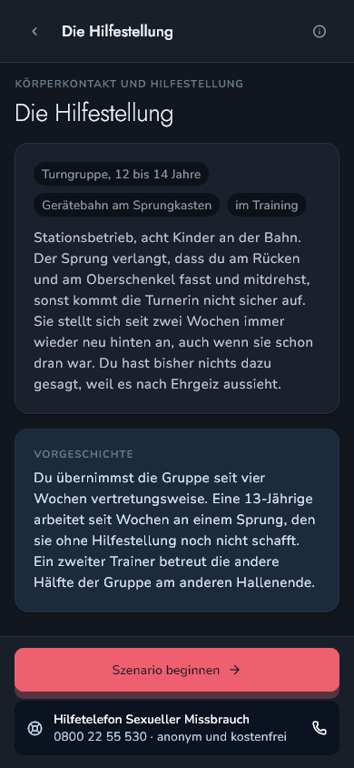 | 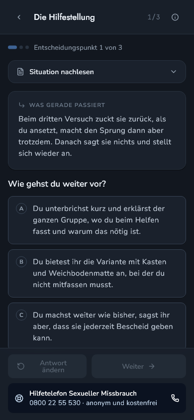 | 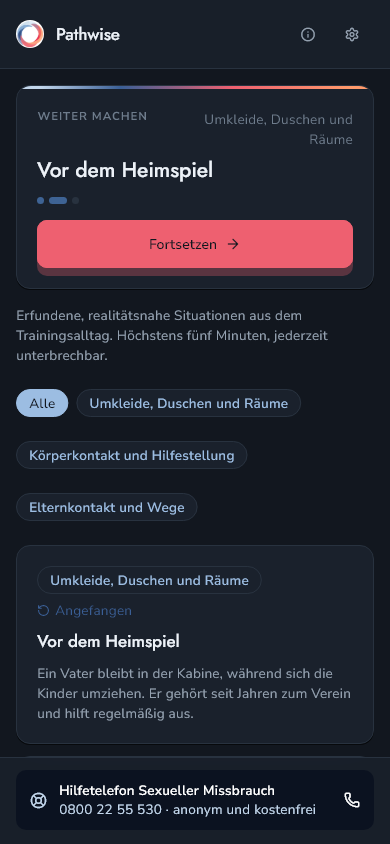 | 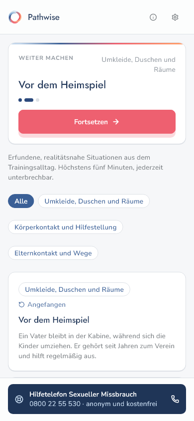 |

| Vereinsangaben | Hilfe und Beratung | So funktioniert Pathwise | Rückmeldung |
|---|---|---|---|
| 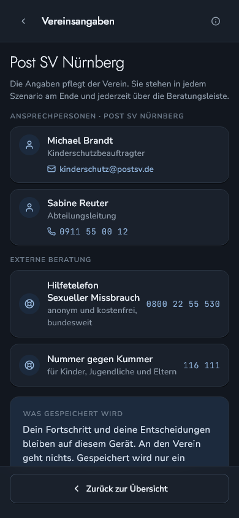 | 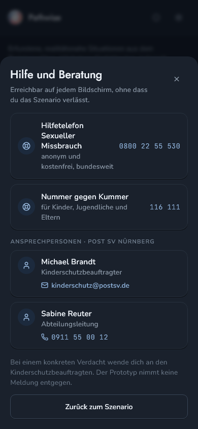 | 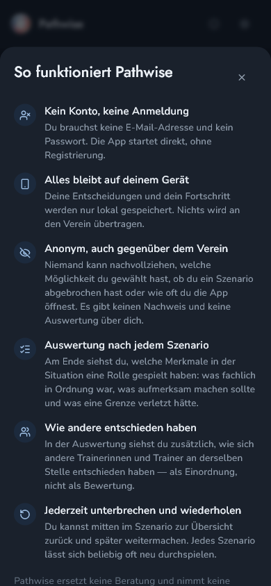 | 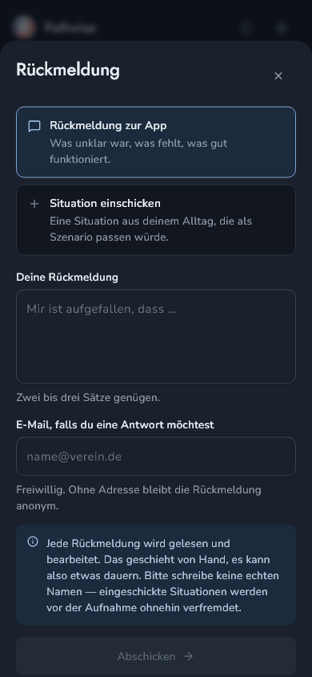 |

Dunkel ist der Standard, nicht die Systemeinstellung — die App wird überwiegend abends auf dem
Handy genutzt.

## Datenschutz: was gespeichert wird

**Auf dem Gerät** (`shared_preferences`, im Web `localStorage`): getroffene Entscheidungen,
begonnene und abgeschlossene Szenarien, ob die Erststart-Karte gesehen wurde, der Theme-Wunsch.

**Zentral, und zwar ausschließlich das:**

- **Ein Zählwert je Szenario, Entscheidungspunkt und Handlungsoption.** Ohne Gerätekennung,
  ohne Sitzungs-ID, **ohne Zeitstempel** — aus Zeitpunkten ließen sich Sitzungen rekonstruieren.
  Gezählt wird nur die **erste** Entscheidung je Entscheidungspunkt und Gerät: „Antwort ändern"
  und „Nochmal" zählen nicht erneut, sonst würde der Spiegel messen, wie oft jemand seine
  Antwort ändert, statt wie sich das Trainerteam entscheidet.
- **Freiwillige Rückmeldungen** aus dem Rückmeldungs-Sheet (Freitext, optionale E-Mail). Diese
  Tabelle ist über die API ausschließlich beschreibbar, nicht lesbar.

Kein Konto, kein Login, kein Analytics-SDK, keine Cloud-Sicherung. Entscheidungen sind weder für
andere Nutzende noch für den Verein auf einzelne Personen rückführbar.

> **Zielkonflikt, offengelegt:** Je kleiner das Trainerteam, desto leichter ließe sich aus wenigen
> Einschätzungen erkennen, wer wie entschieden hat. Deshalb erscheinen Anteilswerte erst ab einer
> Mindestzahl an Einschätzungen je Entscheidungspunkt (aktuell 5, `kSpiegelSchwelle` in
> [`lib/data/spiegel_repository.dart`](lib/data/spiegel_repository.dart)). Darunter zeigt die App
> ihren Empty-State. Der sinnvolle Schwellenwert lässt sich nur am tatsächlichen
> Nutzungsaufkommen im Verein festlegen.

> **Zweiter Zielkonflikt:** Es gibt keine Aussage über Personenzahlen, nur über Durchlaufzahlen.
> Der Verein kann also nicht erheben, wie viele Trainerinnen und Trainer teilgenommen haben. Das
> ist mit der Freiwilligkeit ohne Nachweispflicht konsistent, nimmt dem Verein aber jede
> Steuerungsmöglichkeit.

## Technik

Eine Codebasis, drei Plattformen: **Flutter 3.47 / Dart 3.13**.

```
DESIGN.md                          Referenzdokument: Tokens, Komponenten, Motion, Screens
lib/
  main.dart                        Inhalt, Fortschritt und Supabase werden vor runApp aufgelöst
  design/
    pathwise_tokens.dart           Farben, Abstände, Radien, Schatten, Dauern, Curves
    pathwise_theme.dart            pwTheme(dark:), context.pw, context.isDark
    pathwise_routes.dart           pwRoute und die sechs Page-Transitions
    pw_motion.dart                 Reduzierte Bewegung — gilt für jede Dauer der App
    components/                    16 Komponenten mit allen States aus DESIGN.md §4
  data/
    szenario_modelle.dart          Szenario, Punkt, Option, Merkmal, Info, Beratung, Person
    szenario_repository.dart       lädt assets/szenarien.json
    fortschritt_speicher.dart      lokale Persistenz
    spiegel_repository.dart        Zählwerte senden und lesen
    rueckmeldung_repository.dart   Rückmeldung einsenden
    supabase_config.dart           URL und Key, per --dart-define überschreibbar
  state/durchlauf_state.dart       Riverpod
  screens/                         S1–S9 plus PwScaffold (Kopf, Inhalt, Fuß, Seitenleiste)
assets/szenarien.json              Szenarien, Infos, Beratung, Personen, Module
supabase/migrations/               Schema
test/                              Regeltests und Golden-Aufnahmen aller Screens
design_reference/                  Design-Handoff mit Prototyp und Screenshots (kein Projektcode)
```

**Abhängigkeiten:** `flutter_riverpod`, `shared_preferences`, `url_launcher`, `supabase_flutter`,
`lucide_icons_flutter`.

**Gestaltung.** Farben, Typografie, Abstände, Radien, Schatten und Timings stammen aus
`DESIGN.md` und liegen als Dart-Konstanten vor. Semantische Farben sind eine `ThemeExtension`
(`context.pw`), weil Pathwise Ampelstufen, Rückmeldungsfarben und getönte Flächen hat, die kein
Material-3-Slot abbildet. Der Theme-Wechsel schneidet hart um statt zu blenden.

**Bewegung.** 24 spezifizierte Bewegungen (M1–M24): 80 ms Press-Scale, 140 ms Bedienfeedback,
220 ms Flächen, 360 ms Dialoge. Keine Ripple — Bedienfeedback ist ein Press-Scale auf 0.985.
Jede Dauer läuft durch `PwMotion`; steht im System „Bewegung reduzieren", ist alles sofort im
Endzustand und die Dauerschleifen starten gar nicht erst.

**Barrierefreiheit.** Trefferflächen mindestens 44 dp — auch bei 30 dp großen Icon-Buttons. Jede
Farbaussage trägt zusätzlich Text und Icon. Der Fokusring wird nirgends entfernt. Die
Textskalierung ist nicht gedeckelt und funktioniert bis 200 % ohne Überlauf.

**Responsive.** Unter 360 dp schrumpft das Seitenpolster und die Footer-Buttons stehen
untereinander. Ab 600 dp wird das Szenarioraster zweispaltig. Ab 900 dp erscheint eine 300 dp
breite Seitenleiste, und die drei Ampelstufen stehen nebeneinander.

**Schriften.** Jost, Nunito Sans und JetBrains Mono liegen als statische Schnitte in
`assets/fonts/`, erzeugt aus den Variable-Fonts von `github.com/google/fonts`. Statisch statt
variabel, damit `fontWeight` auf iOS, Android und im Web gleich trifft. Die OFL-Lizenzen liegen
daneben.

## Einrichten und starten

```bash
flutter pub get
flutter run -d chrome          # Web
flutter run -d <geraet>        # iOS oder Android
```

Release-Builds:

```bash
flutter build web --release
flutter build apk --release
flutter build ipa
```

Die App läuft **auch ohne Backend** vollständig: Der Einschätzungsspiegel zeigt dann seinen
Empty-State. Netzfehler blockieren nie.

## Backend

Supabase. URL und publishable key stehen als Vorgabewerte in
[`lib/data/supabase_config.dart`](lib/data/supabase_config.dart) und lassen sich beim Bauen
überschreiben:

```bash
flutter run --dart-define=SUPABASE_URL=https://… --dart-define=SUPABASE_KEY=sb_publishable_…
```

Der publishable key ist dafür gemacht, im Client zu stehen — er gibt für sich genommen keine
Rechte. Was möglich ist, entscheidet allein RLS.

**Schema** ([`supabase/migrations/0001_pathwise.sql`](supabase/migrations/0001_pathwise.sql)):

| Objekt | Zugriff für `anon` |
|---|---|
| `zaehlwerte` (Tabelle) | **keiner** — RLS aktiv, keine Policy |
| `zaehlwert_erhoehen(szenario, punkt, option)` | ausführbar; erhöht um genau eins, prüft die Argumente |
| `spiegel(szenario)` | ausführbar; liefert die Zählwerte eines Szenarios |
| `rueckmeldungen` (Tabelle) | nur `insert` — kein `select`, `update` oder `delete` |

Die Schreibfunktion ist `security definer`, damit Clients nur zählen und keine beliebigen
Zählstände setzen können. Prozentanteile und die Schwelle für „zu wenige Einschätzungen" rechnet
die App.

> Der Datenbank-Linter meldet zu diesem Schema drei Punkte (`rls_enabled_no_policy`, zweimal
> `*_security_definer_function_executable`). Alle drei sind **beabsichtigt** und im SQL
> begründet: Die App hat keine Anmeldung, `anon` muss zählen und lesen dürfen, und der
> Direktzugriff auf die Tabelle ist genau deshalb gesperrt.

## Qualitätssicherung

```bash
flutter analyze     # keine Befunde
flutter test        # 26 Tests
```

**[`test/widget_test.dart`](test/widget_test.dart)** prüft die Regeln, nicht das Aussehen:
Datenstruktur (drei Szenarien à drei Punkte à drei Optionen), Statusableitung, Themenfeld-Filter,
Theme in beiden Modi, das Verhalten der Optionen nach der Wahl und die Zählregel („einmal je
Entscheidungspunkt und Gerät", „Nochmal" zählt nicht erneut).

**[`test/screens_golden_test.dart`](test/screens_golden_test.dart)** rendert jeden Screen bei
390 × 844 — der Preview-Größe des Entwurfs — mit den gebündelten Schriften nach `test/goldens/`.
Diese Bilder sind der Abgleich mit den Referenz-Screenshots aus dem Design-Handoff. Erneuern:

```bash
flutter test --update-goldens test/screens_golden_test.dart
```

Der „Kommt bald"-Dialog wird dabei mit `disableAnimations` aufgenommen — zugleich der Nachweis,
dass die drei Dauerschleifen bei reduzierter Bewegung nicht anlaufen.

## Anforderungen und ihr Umsetzungsstand

Die Anforderungen stammen aus der zugrunde liegenden Bachelor-Arbeit (Kapitel 4.6). GF verweist
auf die Grundfunktion.

### Funktional

| Nr. | Anforderung | Prio | GF | Stand |
|---|---|---|---|---|
| F01 | Szenarien decken die Themenfelder des Trainingsalltags ab, insbesondere mehrdeutige Situationen | Muss | 1 | ✅ 3 Szenarien, 3 Themenfelder |
| F02 | Übersicht der Szenarien mit Themenfeld und Kurzbeschreibung, frei wählbar | Muss | 1 | ✅ |
| F03 | Ausgangssituation, mehrere Entscheidungspunkte mit Leitfrage und genau drei Optionen | Muss | 1 | ✅ |
| F04 | Rahmenangaben: mindestens Altersgruppe, Ort, Vorgeschichte | Muss | 1 | ✅ Rahmen-Chips und Vorgeschichte-Karte |
| F05 | Der Fortgang hängt nicht von der gewählten Option ab | Muss | 4 | ✅ |
| F06 | Abrufbare Rückmeldung, gegliedert in Erkennen, Absichern, Handeln | Soll | 3 | ✅ |
| F07 | Am Ende die Merkmale nach Stufe, inklusive nicht eingetretener, ohne Bewertung der Wahl | Muss | 2 | ✅ |
| F08 | Ansprechpersonen und Meldewege des Vereins mit Name und Kontaktweg | Muss | 6 | ✅ `tel:` / `mailto:`, mit Kopieren als Rückfallebene |
| F09 | Offizielle Beratungsstelle an jedem Punkt abrufbar | Soll | 6 | ✅ Beratungsleiste auf jedem Screen |
| F10 | Anteil je Handlungsoption, ohne Rangfolge, ohne Personenbezug | Muss | 5 | ✅ |
| F11 | Bei zu wenigen Einschätzungen Hinweis statt Anteilen | Soll | 5 | ✅ Schwelle 5, als Konstante geführt |
| F12 | Jederzeit unterbrechbar, Fortschritt auf dem Gerät, Fortsetzen am letzten Punkt | Muss | – | ✅ |
| F13 | Abgeschlossene Szenarien erneut startbar | Kann | 4 | ✅ „Nochmal" |
| F14 | Übersicht bearbeiteter und offener Szenarien, ohne Punktestand und Bestenliste | Kann | – | ✅ Status je Karte |
| F15 | Ansprechpersonen, Meldewege und Szenarien ohne technische Kenntnisse pflegbar | Soll | – | ⚠️ **teilweise** — Inhalte liegen getrennt in `assets/szenarien.json`, eine Oberfläche zum Pflegen gibt es nicht |

### Nichtfunktional

| Nr. | Anforderung | Prio | Stand |
|---|---|---|---|
| NF01 | Ein Durchlauf dauert höchstens 5 Minuten | Muss | ⚠️ **nicht messbar ohne Erprobung** — Umfang ist darauf ausgelegt |
| NF02 | Keine Zeitbegrenzung für einzelne Entscheidungen | Muss | ✅ |
| NF03 | Ohne Einführung, Schulung oder anleitende Person nutzbar | Muss | ⚠️ **nicht messbar ohne Erprobung** — Erststart-Karte und Info-Sheet erklären die App in sich |
| NF04 | Entscheidungen nicht auf Personen rückführbar | Muss | ✅ |
| NF05 | Fortschritt nur lokal; zentral nur ein Zählwert; keine personenbezogenen Daten | Muss | ✅ |
| NF06 | Begrenzter Textumfang, Sprache des Trainingsalltags, keine Fachbegriffe und Modelle | Muss | ✅ |
| NF07 | Schematische Darstellung | Muss | ✅ |
| NF08 | Ohne Anmeldung und ohne Installation im Browser nutzbar | Soll | ✅ **übererfüllt** — Web plus native iOS- und Android-App |
| NF09 | Szenarien erfunden, aber realitätsnah; keine realen Vorfälle | Muss | ✅ |
| NF10 | Spielelemente ordnen sich dem Inhalt unter; keine Richtig-Falsch-Bewertung | Muss | ✅ |
| NF11 | Freiwillig, ohne Nachweis-, Abschluss- oder Fristenpflicht | Muss | ✅ |
| NF12 | Vereinsangaben in wenigen Minuten ohne technische Kenntnisse pflegbar | Kann | ❌ **offen** — siehe F15 |
| NF13 | Szenarienbestand erweiterbar, ohne Aufbau oder Ablauf zu ändern | Soll | ✅ Neue Szenarien nur in `assets/szenarien.json` eintragen |

## Grenzen

**Zur Wirksamkeit.** Es gibt **keine Evaluation**. Weder Lernerfolg noch Akzeptanz, Verweildauer
oder Auswirkung auf das Verhalten im Training sind geprüft. Für ein Instrument in diesem Feld ist
das die wichtigste offene Aufgabe. Dazu kommen die drei
[Befunde, die gegen das Konzept sprechen](#drei-befunde-die-gegen-das-konzept-sprechen).

**Zur Bedarfsanalyse.** Sie beruht auf zwei Befragten aus einem einzigen Verein und ist damit
keine repräsentative Erhebung. Die Interviews waren leitfadengestützt, aber nicht nach einem
methodisch abgesicherten Auswertungsverfahren analysiert. Es fehlt eine beobachtende Komponente
— alle Aussagen über den Trainingsalltag sind mündliche, rückblickende Selbstauskünfte. Für eine
belastbare Grundlage müssten mehr Personen aus unterschiedlichen Rollen befragt werden.

**Zum Konzept.** Die Anwendung meldet **nicht** zurück, ob die eigene Reaktion angemessen war —
obwohl ein Teil der Zielgruppe genau das sucht. Ob der Abgleich im Trainerteam das auffängt, ist
nicht geprüft. Die Konzeption erfolgte durch eine Einzelperson; Perspektivenvielfalt als eigene
Praktik entfällt damit.

**Zur Umsetzung.**

- **Der Fortschritt hängt am Gerät und am Browser.** Gerätewechsel, gelöschter Speicher oder
  privater Modus bedeuten einen Neuanfang. Bei fünf Minuten je Szenario ist das verkraftbar,
  muss aber benannt werden.
- **Mehrfachzählung ist nicht technisch erzwingbar.** Die App zählt je Entscheidungspunkt und
  Gerät genau einmal, aber das ist eine Client-Regel — im Vereinskontext fehlt allerdings jeder
  Anreiz zur Manipulation.
- **Der Vereinsbezug braucht einen Träger.** Ansprechpersonen und Vereinsname stehen derzeit
  fest im Asset. Wie ein Gerät „seinen" Verein erfährt — Einladungslink, Code, eigene
  Build-Variante — ist nicht entworfen.
- **Nicht gestaltet und deshalb nicht gebaut** (siehe `DESIGN.md` §11): Splash und App-Icon,
  Vereinszuordnung, Ladezustände beim Erststart, Offline-Banner, Fehler-Screen, Einstellungen
  über das Theme hinaus, Datenlöschung, Suche in der Szenarioliste, die drei angekündigten
  Module hinter „Kommt bald", Deeplinks, Push und Widgets.
- **Ein iOS-Build ist bisher nicht auf einem Mac verifiziert.** Konfiguration ist gesetzt, Web
  und Android sind gebaut.

**Inhaltlich.** **Alle Szenariotexte sind erfunden und fachlich ungeprüft.** Vor jeder Verwendung
im Verein müssen sie durch den Kinderschutzbeauftragten geprüft werden. Ebenfalls offen:
Schriftlizenzen (Jost und Nunito Sans stehen für die tatsächliche Wortmarken-Schrift ein),
Icons (Lucide ist ein Substitut), die Anrede „du", das Backend-Datenschema als Vorschlag sowie
Impressum, Datenschutzerklärung und Barrierefreiheitserklärung.

## Herkunft, Lizenzen, Quellen

Pathwise entstand aus der Bachelor-Thesis **„Konzeptionelle Entwicklung eines Prototyps zur
Unterstützung bei der Implementierung von Präventionsmaßnahmen gegen sexualisierte Gewalt im
Sport"** (Jonathan Sommerer, Deutsche Hochschule für Prävention und Gesundheitsmanagement,
Studiengang Sport- und Gesundheitsinformatik). Diese Umsetzung weicht an einzelnen Stellen
bewusst von der Arbeit ab — die Abweichungen sind Weiterentwicklungen, keine Auslassungen.

Der visuelle Entwurf liegt als Design-Handoff unter `design_reference/` (Referenzdokument,
interaktiver Prototyp, Screenshots). `DESIGN.md` im Repo-Root ist die maßgebliche Fassung für die
Implementierung.

**Schriften:** Jost, Nunito Sans, JetBrains Mono — SIL Open Font License, Lizenztexte unter
`assets/fonts/`.
**Icons:** [Lucide](https://lucide.dev) 0.441, ISC License.

### Zentrale Quellen

- Bittner, Hoffmann, Hoffmann & Fegert (2026): „Uuugh – Falsches Spiel", Vorevaluation
- Brackenridge & Fasting (2005): Grooming-Phasenmodell im Sport
- Breuer & Bente (2010): Begriffshierarchie und Gestaltungshinweise zu Serious Games
- Deterding, Dixon, Khaled & Nacke (2011): Definition von Gamification
- Götzl, Pichlmeier, Streb & Dudeck (2025): Interviewstudie mit (potenziellen) Tätern
- Horch, Schubert & Walzel (2024): Anreizstruktur und Personalisierung im Sportverein
- Ohlert et al. (2018): Prävalenz sexualisierter Gewalt im deutschen Sport
- Palzkill (2021): Erscheinungsformen, Risikofaktoren, Präventionsbausteine
- Ritterfeld, Shen, Wang, Nocera & Wong (2009): Interaktivität und Multimodalität
- Rulofs (2024): Verbreitung von Schutzmaßnahmen auf Vereinsebene
- Sailer & Homner (2020): Metaanalyse zur Wirksamkeit von Gamification
- Schmitz et al. (2025): „Safe Clubs"
- Tolks et al. (2020): Serious Games und Gamification in Prävention und Gesundheitsförderung
- Wouters, van Nimwegen, van Oostendorp & van der Spek (2013): Metaanalyse zu Serious Games

Vollständige Angaben im Literaturverzeichnis der Bachelor-Arbeit.

---

**Pathwise gehört zur Prävention. Es ersetzt keine Meldung und keine Beratung.**
Bei einem konkreten Verdacht führt der Weg über die Ansprechpersonen im Verein.
Hilfetelefon Sexueller Missbrauch: **0800 22 55 530**, anonym und kostenfrei.
